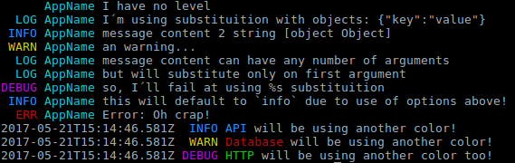

# smalllog

Smalllog is a simple console logging system for nodejs using colors and logging levels.

## instalation

```bash
npm i smalllog
```

## configuration

There is a few parameters you can set:

name   | default | description
----------|:--------:|-----------------------------------------
colors    | true    | use color in console output
time      | false   | show timestamp on output
level     | 5         | threshold point to show messages
default | 'info'   | which message to show when you call directly

## usage



```javascript

// initialize with default parameters
log = require('smalllog')('Worker')

// initialize with non default
log = require('smalllog')('Worker').options({default: 'log'})

log.log('message content');
log.info('message content', 2, 'string', {obj: true});
log.err('message content');
log.error('message content');
log.debug('message content');

// if you call log directly it will default to the `option.default`
// == log.info by default
log('this will default to `log` due to use of options above!');

// if you create another logger with another name then it´ll use another color

// if you create another logger with the SAME name it uses the same color

// colors are based on order of creation

log2 = require('smalllog')('API');
log3 = require('smalllog')('Database');
log4 = require('smalllog')('HTTP');

log2('API will be using another color!');
log3('Database will be using another color!');
log4('HTTP will be using another color!');

```
